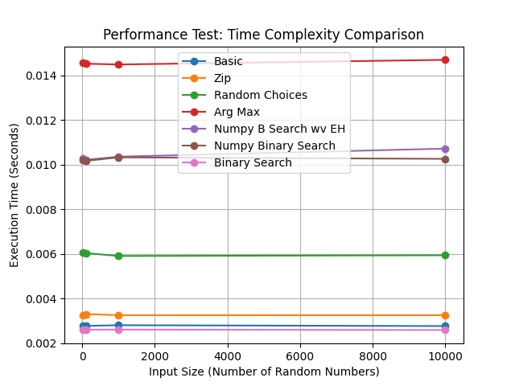
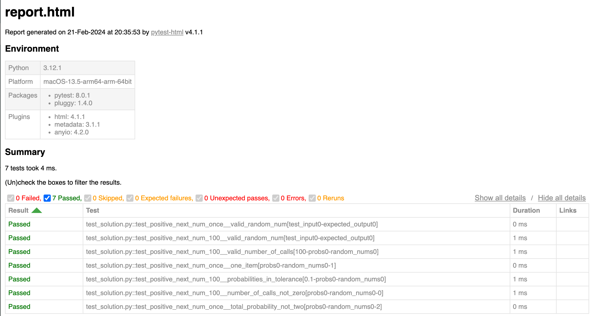
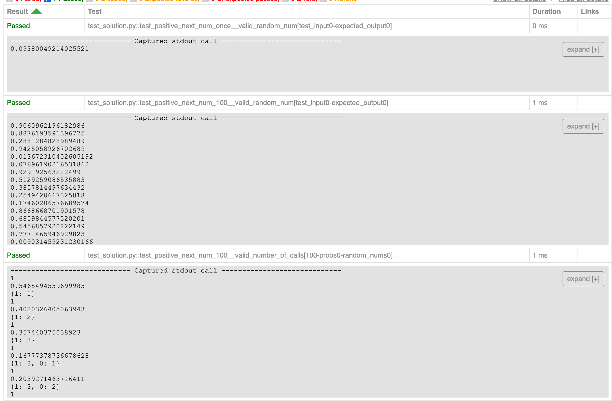

# 🌟 RandomGeneratorModels 🌟 🚀 
- ⚡️ LIVE ⚡️ The model is hosted, and can be triggered with a Flask API endpoint: [Click here to open the endpoint](https://mathematicuslucian.eu.pythonanywhere.com/run_model) (Or, call it with Postman.)
---

## Table of Contents
1. [Introduction](#introduction)
2. [Python Models 🐍🐍🐍 - including with Numpy](#python)

    a. [First line/unit testing/TDD: PyTest](#pytest)

    b. [🌟 Python Performance Tests 📈](#python-performance-tests)

    c. [VirtualEnv](#virtualenv)

    d. [Requirements File](#generate-requirements-file)

3. [Java](#java)
4. [TypesScript](#typescript)
5. [Flask API](#flask-api)
6. [React UI](#react-ui)
7. [Deployment](#deployment)
---

# Introduction
The random generator services aim to generate random numbers based on the given probabilities. The probabilities are used to determine the likelihood of each random number occurring. Python was opted for. *(There are also implementations in Java, and TypeScript, though less time was put into these solutions.)* This README file provides an explanation of the approach, and some instructions for setting up, running, testing, and deploying the random generator services in different languages. 

*(Nb. these are within the same repo for simplicity when it comes to sharing this with whomever will review this; but if this was a real project, I would be inclined to have microservices in seperate repos, rather than a monorep.)*

# Python Models 🐍🐍🐍
This repo provides and compares the performance of seven Python models of a random number generator service. 

The solutions are as folows:
1. **Basic:** Simple implementation. Quickly thrown together, without third-party libraries. Iterates through probabilities to find the appropriate random number.
### OOP with a constructor
2. **Zip:** There is encouragement in the exercise critieria to look at making the solution more "pythonic". I added a constructor. I also used 'zip' to align the RandomNums and Probabilites arrays - intent being to speed up the model through "precompute" of the time-consuming alignment of the two arrays (RandomM and probabilities), but this was slower than the initial crude approach.
3. **Random Choices:** I then added Random Choices, but I found this was even slower. 
4. **Arg Max & Numpy:** Tried the third-party library Numpy to see if its array functions would speed up the model.  I found Arg Max was slower again (the less optimal peformance of the 7 solutions.)
5. **Binary Search (with Numpy):** Implemented NumPy arrays to store random numbers and probabilities. At this momement, I also took binary search tree approach. The thought behind this was that combining NumPy efficient array operations with functional programming principles would leverage the best of both worlds: the computational efficiency and versatility of NumPy with the clarity and maintainability of functional programming. This was faster than Arg Max, but not as quick as the other vanilla approaches. This may need deeper investigation. NumPy allows operations to be performed on entire arrays at once, known as vectorization, and thus, avoids the need to explicitly loop over elements.
6. **Binary Search (with Numpy, and ErrorHandling):** I tweaked the approach from #5, and added some error handling, but the performance difference was negligible. The next_num method utilizes NumPy functions like np.random.random() for generating random numbers and np.cumsum() for calculating cumulative probabilities. The np.argmax() function is employed again - to find the index of the first occurrence where the generated random number is less than the cumulative probabilities.
7. **Most Optimal  🌟 🌟 🌟 Binary Search (without Numpty):** At this moment, I wanted to see like-for-like whether the binary search was faster with or without Numpy. 

``__init__`` utilised so that these are modules that can be referenced by the unit tests, and even hypothetically, Flask or FastAPI, or a performance tests.

### The Python models directory
``cd python_models``: there is a directory for each of the seven solutions respectively.

### Install dependencies
``pip install -r requirements.txt``

### Run Python model ONE - without additional libraries
``python random_gen.py``

## 👩‍🔬 First line/unit testing/TDD: PyTest
There is a file ``test_solution_all.py`` in the main 'python_models' folder that will call all 7 Python apps, and run tests on them. (Also, individual test files, if you prefer, in each folder, beside the respective Python app.)

Navigate to the directory of one of the models: ``pytest --html=report.html test_solution.py``

The unit tests are conducted for all the Python approaches, with or without a constructor, and whether or not they have third-party libraries. In all cases, the same test data is utilised.

As the output of the generator is random, this limits the test options, i.e. I cannot test that a certain integer value is returned. Thinking of financial scenarios, with considerations such as variability, and velocity, where deviance, such as beyond the efficient frontier, or high/low fluctuations in stock prices, may be critical, I tested that the count of each 'random number' is within a tolerance of its respective expected probability.

***🏭 Crude Factory:*** *I didn't want to write the same test code over and over, so I hacked together a crude factory method approach to feed the classes into a function, that generates each in turn, running the tests. If any fail, it gives the name of the respective class. This could be prettier, but I will stop there, because I have already exceeded the remit.*

## 🌟 Performance Test Engine (Python) 📈
In ``performance_test_engine.py``.

- **Sample implementation:** In the file ``performance_test.py``. This can be triggered from a FASTAPI or Flask API service, or you can call it from the CLI: ``python3 performance_test.py``

- **Purpose:** I need to evalute these models, and find out their actual speeds, to compare their performance. The performance test is conducted for all the Python approaches, with or without a constructor, and whether or not they have third-party libraries. In all cases, the same test data is utilised (and prepared as a Pandas dataframe):

    #Test data
    random_nums = [-1, 0, 1, 2, 3]
    probabilities = [0.01, 0.3, 0.58, 0.1, 0.01]
    iteration_levels = [10, 100, 1000, 10000]  # Add more levels as required
    tolerance = 1.0
    PYTHON_RANDOM_GEN_CLASSES = [
        { "class": RandomGen, "name": 'Basic' },
        { "class": RandomGenZip, "name": 'Zip' },
        { "class": RandomGenRandomChoices, "name": 'Random Choices' },
        { "class": RandomGenNumpyArgMax, "name": 'Arg Max' },
        { "class": BinaryNumpyWithErrorHandling, "name": 'Numpy B Search wv EH' },
        { "class": RandomGenBinarySearchNumpy, "name": 'Numpy Binary Search' },
        { "class": RandomGenBinarySearch, "name": 'Binary Search' }
    ]

- **Pandas 🐼🐼🐼:** The ``generate_test_data`` function (in the utils folder) runs the performance tests. It returns it as a Pandas DataFrame, featuring the execution times for each generator to each defined level of iteration. I implemented with Pandas to handle the input data in a more structured and efficient way. (Or perhaps an excuse to demonstrate that I can utilise these third-party libraries.)

- **📈 Chart with MatPlotLib** I employed MatPlotLib to generate a chart (above in the README) of the performance results. ``save_plot_chart``: This line runs the function to save the chart to file (when running on local machine; disabled on the server.) Could dump this image data in a different format into a database.

- **Results:** Current result, shows Binary Search is the faster model:

    ('Basic', [10, 100, 1000, 10000], [0.0027840137481689453, 0.0027718544006347656, 0.0028028488159179688, 0.0027649402618408203])

    ('Zip', [10, 100, 1000, 10000], [0.0032629966735839844, 0.003304004669189453, 0.0032529830932617188, 0.0032510757446289062])

    ('Random Choices', [10, 100, 1000, 10000], [0.00604701042175293, 0.006039142608642578, 0.005906820297241211, 0.005939960479736328])

    ('Arg Max', [10, 100, 1000, 10000], [0.014555931091308594, 0.014529943466186523, 0.01449441909790039, 0.014703035354614258])

    ('Numpy B Search wv EH', [10, 100, 1000, 10000], [0.010276079177856445, 0.01022195816040039, 0.0103607177734375, 0.010721921920776367])

    ('Numpy Binary Search', [10, 100, 1000, 10000], [0.010213851928710938, 0.010170936584472656, 0.0103302001953125, 0.010263204574584961])

    ('Binary Search', [10, 100, 1000, 10000], [0.002596139907836914, 0.0026030540466308594, 0.0026056766510009766, 0.002586841583251953])

**Opportunities:** I have gone beyond the remit already, so restrain my desire to create a broader sample. There may be less potential bias if the performance tests were run again for all input sizes, but with several different sets of random numbers and probabilities. 

- ***🏭 Crude Factory:*** *I didn't want to write the same test code over and over, so I hacked together a crude factory method approach to feed the classes into a function, that generates each in turn, running the tests. This could be prettier, but I will stop there, because I have already exceeded the remit.*

## VirtualEnv
A virtual environment (to ensure that the dependencies for the project are isolated from the system-wide Python installation, so as to facilitate distribution of the project.)

### Create a virtual environment named 'venv'
``pip3 install virtualenv``

``python3 -m venv randomgen_env``

Check running correctly: ``pip list`` (shows dependencies installed on the virtual environment.)

### Activate
On Windows: ``venv\Scripts\activate``

On macOS/Linux: ``source randomgen_env/bin/activate``

### Deactivate
``deactivate``

## Generate Requirements File
A requirements.txt file containing the dependencies installed to the virtual environment.

``pip install numpy`` etc.

Then: ``pip freeze > requirements.txt``

Install from a requirements file: ``pip install -r requirements.txt``

# Java
**This has not received as much attention as the Python approach.** I have not pursued this far, because that would be beyond remit.

Provides a Java implementation of the random number generator service. Computes the cumulative probability and selects a random number based on the probabilities.

### Compile the Java code
I have not pursued this far, because that would be beyond remit, and do not promise that it functions well:
``javac RandomGen.java``

### Run the Java application
I have not pursued this far, because that would be beyond remit, and do not promise that it functions well: ``java RandomGen``

### Unit Tests
The file ``tests-junit.java``

# Typescript
**This has not received as much attention as the Python approach.** I have not pursued this far, because that would be beyond remit. Provides a TypeScript implementation of the random number generator service. Computes the cumulative probability and selects a random number based on the probabilities.

### Compile the TypeScript code
``tsc randomGen.ts``

### Run the TypeScript code using Node.js
I have not pursued this far, because that would be beyond remit, and do not promise that it functions well:``ts-node RandomGen.ts``

### Unit tests
I have not pursued this far, because that would be beyond remit, and do not promise that it functions well:``npm test``

# Flask API
PythonAnywhere is free hosting (yay!) but cheap or free isn't always best. It does not support ASGI, so no FastAPI, which would have auto-generate lovely Swagger docs if I declared the structures of the data types.

- **Localhost:** ``python3 app.py``
- **Deploy with uWSGI:** ``uwsgi --http :5000 --module app:app`` (or could use gunicorn)
- **.Env File:** None of this hardcoding passwords into repos security risk nonsense. Details in a ``.env`` file that the ``.gitignore`` file notes is to be ignored.

**Endpoints**

``/run_model``: Runs the most optimal model.

- (POST request)

- Requires to which expects two parameters `random_nums`, and `probabilities`, i.e. to some degree this is dynamic. (Allows for a UI to be employed so that a user may pass through different values.)

- Example reponse:
    
    {
        "Arg Max": 0.0810598267449273,
        "Basic": 0.018863810433281794,
        "Binary Search": 0.020829174253675673,
        "Numpy B Search wv EH": 0.0705918206108941,
        "Numpy Binary Search": 0.08169968922932942,
        "Random Choices": 0.04187014367845324,
        "Zip": 0.017680380079481337
    }

- An improvement would be not to hardcode which model to run, but present a Select element to the user (in the UI) so they determine which class to run (or even an option for the app to determine such according to upon the exec times in the database) - but this Flask API microservice is already beyond the remit.

``/run_performance``: Runs each model.

- (GET request)

- Will save the performance to the Sqlite3 database.

- This is hardcoded, i.e. the names of the models; which relate to Python classes, but this could be dynamic, with error handling where an invalid class name - but this Flask API microservice is already beyond the remit. The actual Performance Test Engine is dynamic. 

- Another improvement would be to save timestamp with each performance run; and this could allow a time-series consideration, except this may be an opportunity demonstrate/explore the logic/functionality rather than necessarily a use case to run a performance test daily.

``/performance_results_avg``: Returns from the Sqlite3 database the average execution time per model, per iteration level, across all past performance runs (these are stored in the database.) 

- (GET request)

- *The taking of an average across multiple performance evalution runs increases the sample size, and thus reduces bias.*

- Example response:

    {
        "Arg Max": 0.0810598267449273,
        "Basic": 0.018863810433281794,
        "Binary Search": 0.020829174253675673,
        "Numpy B Search wv EH": 0.0705918206108941,
        "Numpy Binary Search": 0.08169968922932942,
        "Random Choices": 0.04187014367845324,
        "Zip": 0.017680380079481337
    }

``/performance_results_all``: This is similar to ``/performance_results_avg`` but returns from the Sqlite3 database ALL execution times per mode, per iteration level.

- (GET request)

### React UI
Very crude app. I have not pursued this far, because that would be beyond remit. If this were for production, I would add more tests, liniting, and even setup Storybook, etc.. This is outside the remit, and just hacked together to show the chart.

**Local Setup**
To run the React UI and the random generator services locally, follow these steps:
1. **Install dependencies:** ``npm install`` (or ``npm i``)
2. **Run the development server** ``npm run build && serve -s build``, and then open http://localhost:3000 in your browser.

**Webpack:** For a production app, this would have environments established, e.g. dev, staging, and prod.

## Deployment 📦📦📦

Tempted to setup Docker, and also to deploy this as an AWS Lambda, but as the Flask API service is outside the remit, I have simply just put it on a free PythonAnywhere account.

**UI URL**

``TBD``

**Flask endpoints**

``https://mathematicuslucian.eu.pythonanywhere.com/run_model``

``https://mathematicuslucian.eu.pythonanywhere.com/run_performance``

``https://mathematicuslucian.eu.pythonanywhere.com/performance_results_avg``

``https://mathematicuslucian.eu.pythonanywhere.com/performance_results_all``